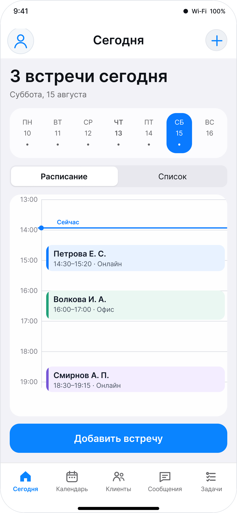
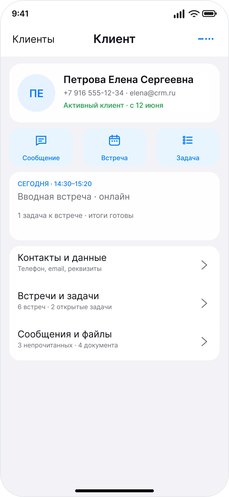
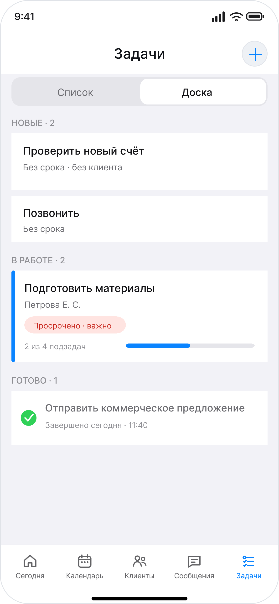

# Simple CRM — работа с клиентами в одном месте

Светлый многостраничный лендинг мобильной CRM для ведения клиентов, встреч, переписки, задач, документов и платежей. Интерфейс продукта разработан для iPhone, а композиция и динамика лендинга вдохновлены подачей Dextr.

[](https://www.figma.com/design/CHi07sT4Waf6uIkl14hYjN/Simple-CRM?node-id=25-13&t=9RAUidalNxHfdYwn-1)


## О проекте

Simple CRM помогает держать весь контекст работы с клиентом в одном приложении: видеть расписание, готовиться к встречам, продолжать переписку, фиксировать договорённости и контролировать задачи. Репозиторий содержит готовый лендинг и полный набор экспортированных продуктовых экранов.

### Основные возможности

- единая карточка клиента с контактами и историей взаимодействий;
- календарь, расписание дня и создание встреч;
- сообщения и продолжение разговора без потери контекста;
- доска и список задач, приоритеты и сроки;
- документы, платежи и рабочие материалы;
- отдельные страницы продукта, тарифов, справки, обновлений и поддержки;
- плавные анимации появления, hover-состояния и адаптивная навигация;
- светлая визуальная тема с мягкими синими переливами.

## Дизайн в Figma

Исходный дизайн, компоненты, сценарии и экраны приложения находятся в файле **[Simple CRM](https://www.figma.com/design/CHi07sT4Waf6uIkl14hYjN/Simple-CRM?node-id=25-13&t=9RAUidalNxHfdYwn-1)**.

В макете собраны дизайн-система, iPhone-экраны, прототипные сценарии, материалы для передачи разработчику и графика для лендинга. Изображения, используемые на сайте, экспортированы в каталог [`simple-crm-landing-screens`](./simple-crm-landing-screens/).

## Экраны продукта

| Сегодня и расписание | Карточка клиента | Задачи |
| --- | --- | --- |
|  |  |  |

В репозитории находятся 25 подписанных экранов: расписание, календарь, встречи, клиенты, поиск, сообщения, задачи и платежи. Все изображения показаны целиком, без декоративных подложек и принудительной обрезки.

## Страницы лендинга

- `/` — главная страница;
- `/about/` — о продукте;
- `/pricing/` — тарифы;
- `/faq/` — частые вопросы;
- `/learn/` и `/how-to/` — материалы и инструкции;
- `/announcements/` и `/releases/` — обновления и версии;
- `/privacy/` — конфиденциальность;
- `/support/` — поддержка;
- `/search/` — поиск по материалам.

## Локальный запуск

Проект не требует сборки или установки зависимостей. Запустите любой статический HTTP-сервер из корня репозитория, например:

```bash
npx serve .
```

После запуска откройте адрес, который появится в терминале. Для корректной работы переходов между страницами не рекомендуется открывать HTML-файлы напрямую через `file://`.

## Структура проекта

```text
├── index.html                       # главная страница
├── about, pricing, faq, learn ...  # внутренние страницы
├── src/
│   ├── components/                 # общие блоки и оболочка сайта
│   └── data/                       # тексты и данные страниц
├── styles/                         # токены, компоненты и стили аудита Dextr
├── assets/fonts/                   # локальные шрифты Onest и Manrope
└── simple-crm-landing-screens/     # 25 продуктовых экранов из Figma
```

## Технологии

- семантические HTML5-страницы;
- модульный JavaScript без фреймворка;
- CSS custom properties, Grid и Flexbox;
- локальные шрифты Onest и Manrope;
- адаптивные стили и поддержка `prefers-reduced-motion`.

## Статус

Лендинг собран и визуально проверен на всех маршрутах. Контент и продуктовые изображения можно заменять независимо, сохраняя существующую композицию и систему стилей.

---

**Simple CRM** — меньше переключений, больше внимания клиенту.
